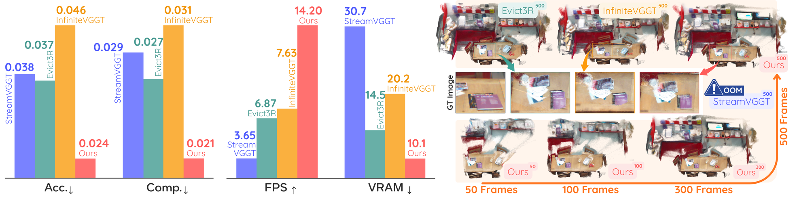
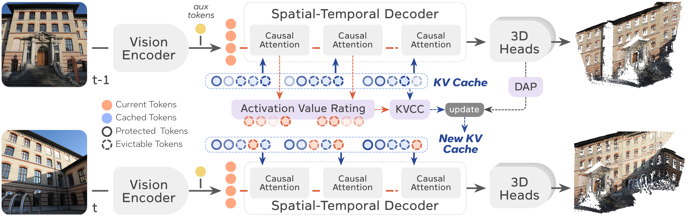

# OVGGT: O(1) Constant-Cost Streaming Visual Geometry Transformer

<p align="center">
  <a href="https://arxiv.org/abs/2603.05959"></a>
  <a href="https://vaisr.github.io/OVGGT"></a>
</p>

<!-- **[Si-Yu Lu]()<sup>1</sup>, [Po-Ting Chen]()<sup>2</sup>, [Hui-Che Hsu]()<sup>2</sup>, [Sin-Ye Jhong]()<sup>2</sup>, [Wen-Huang Cheng]()<sup>1</sup>, [Yung-Yao Chen]()<sup>2</sup>** -->
**Si-Yu Lu<sup>1</sup>, Po-Ting Chen<sup>2</sup>, Hui-Che Hsu<sup>2</sup>, Sin-Ye Jhong<sup>2</sup>, Wen-Huang Cheng<sup>1</sup>, Yung-Yao Chen<sup>2</sup>**

<sup>1</sup>National Taiwan University &nbsp;&nbsp; <sup>2</sup>National Taiwan University of Science and Technology

---

**TL;DR:** OVGGT is a *training-free* framework enabling streaming 3D reconstruction from arbitrarily long video with **constant memory and compute** — achieving O(1) per-frame cost while surpassing full-cache baselines in accuracy.

<p align="center">
  
</p>

<p align="center">
  <b>Left:</b> Quantitative comparison on 7-Scenes across 200 frames. <b>Right:</b> Qualitative 3D reconstructions demonstrating OVGGT's stability over long sequences (50–500 frames).
</p>

## News

## Overview

OVGGT is a **training-free** framework that enables streaming 3D reconstruction from arbitrarily long video with **constant memory and compute**. It combines *Self-Selective Caching* (SSC) for zero-overhead KV cache compression via FFN residual magnitudes, and *Dynamic Anchor Protection* (DAP) to shield geometrically critical tokens from eviction, suppressing coordinate drift over long sequences. OVGGT is fully compatible with FlashAttention and processes videos within a fixed VRAM envelope while surpassing full-cache baselines in accuracy.

<p align="center">
  
</p>

## ⚙️ Installation

1. Clone OVGGT
```bash
git clone https://github.com/<your-username>/OVGGT.git
cd OVGGT
```

2. Create conda environment
```bash
conda create -n OVGGT python=3.11 cmake=3.14.0
conda activate OVGGT 
```

3. Install requirements
```bash
pip install -r requirements.txt
conda install 'llvm-openmp<16'
```

### Download Checkpoints

Please download checkpoint of StreamVGGT from [Hugging Face](https://huggingface.co/lch01/StreamVGGT/) or [Tsinghua cloud](https://cloud.tsinghua.edu.cn/d/d6ad8f36fcd541bcb246/).

## Evaluation
The evaluation code follows [MonST3R](https://github.com/Junyi42/monst3r/blob/main/data/evaluation_script.md), [CUT3R](https://github.com/CUT3R/CUT3R/blob/main/docs/eval.md), [TTT3R](https://github.com/Inception3D/TTT3R), [StreamVGGT](https://github.com/wzzheng/StreamVGGT) and [InfiniteVGGT](https://github.com/AutoLab-SAI-SJTU/InfiniteVGGT).


```bash
cd src/
```

### Multi-view Reconstruction
```bash
bash eval/mv_recon/run.sh 
```

Results will be saved in `eval_results/mv_recon/${model_name}_${ckpt_name}/logs_all.txt`.

### Video Depth
```bash
bash eval/video_depth/run.sh 
```

Results will be saved in `eval_results/video_depth/${data}_${model_name}/result_scale.json`.

### Pose Evaluation
```bash
bash eval/pose_evaluation/run.sh 
```

Results will be saved in `eval_results/pose_evaluation/{data}_${model_name}/_error_log.txt`.


## 🚀 Quick Start

### Viser Demo (Interactive 3D Visualization)
We provide a demo for OVGGT, based on the demo code from [InfiniteVGGT](https://github.com/AutoLab-SAI-SJTU/InfiniteVGGT). You can follow the instructions below to launch it.
```bash
python demo_viser.py  \
    --seq_path path/to/nrgbd/image_sequence \
    --frame_interval 10 \
    --gt_path path/to/nrgbd/gt_camera (Optional)
```

### Gradio Demo (Web UI)
We provide a demo for OVGGT, based on the demo code from [VGGT](https://github.com/facebookresearch/vggt). You can follow the instructions below to launch it.
```bash
pip install -r requirements_demo.txt
python demo_gradio.py
```


## 🙏 Acknowledgements
Our code is based on the following brilliant repositories:

[DUSt3R](https://github.com/naver/dust3r)
[MonST3R](https://github.com/Junyi42/monst3r.git)
[Spann3R](https://github.com/HengyiWang/spann3r.git)
[CUT3R](https://github.com/CUT3R/CUT3R)
[VGGT](https://github.com/facebookresearch/vggt)
[Point3R](https://github.com/YkiWu/Point3R)
[StreamVGGT](https://github.com/wzzheng/StreamVGGT)
[TTT3R](https://github.com/Inception3D/TTT3R)
[Evict3R](https://github.com/soroush-mim/evict3r)
[InfiniteVGGT](https://github.com/AutoLab-SAI-SJTU/InfiniteVGGT)

Many thanks to these authors!

## 📝 Citation

```bibtex
@article{lu2026ovggt,
  title={OVGGT: O(1) Constant-Cost Streaming Visual Geometry Transformer},
  author={Si-Yu Lu and Po-Ting Chen and Hui-Che Hsu and Sin-Ye Jhong and Wen-Huang Cheng and Yung-Yao Chen},
  journal={arXiv preprint arXiv:2603.05959},
  year={2026}
}
```
